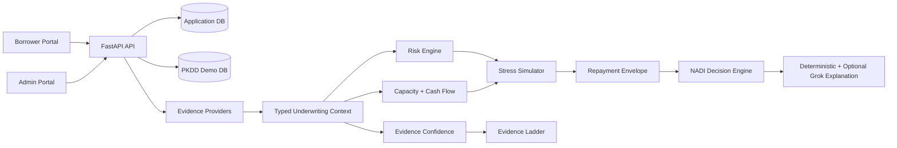

# Architecture

TVS NADI is a FastAPI and Next.js underwriting prototype for thin-file and new-to-credit borrowers.

Core boundaries:

- Offline analytics and model training may use pandas heavily.
- Live platform underwriting builds explicit domain context before invoking engines.
- Grok/xAI is explanation-only and never makes credit decisions.
- Raw sensitive alternative-data payloads are not persisted in underwriting records.

